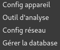
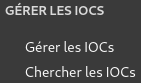
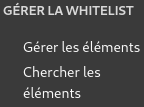
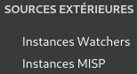

# Bienvenue sur le site SpyGuard de CyberCape

Sur ce site, vous trouverez de l'aide pour utiliser le logiciel SpyGuard.

SpyGuard est un logiciel avancé de TinyCheck. Il sert à détecter si votre appareil est espionné par un tiers.

Pour cela il utilise le wifi, ce qui signifie qu'il peut être utilisé avec plusieurs appareils comme des téléphones, des tablettes, des ordinateurs portables, etc ...

## Lien

Si vous souhaitez modifier des paramètres/configurer SpyGuard, veuillez cliquer sur ce <a href="https://localhost:8443" target="_blank">lien</a> les identifiants sont _cybercape/cybercape_ 

Si vous souhaitez directement passer à l'analyse de votre appareil en gardant les paramètres par défaut, veuillez cliquer sur ce <a href="https://localhost:8000" target="_blank">lien</a>.

## Paramètres du logiciel

Les premiers paramètres se trouvent dans l'onglet  

Effectivement il y a plusieurs réglages possibles : 

- Config appareil permet de configurer SpyGuard. 
- Outil d'analyse va permettre de configurer les méthodes de détection.
- Config réseau permet de définir les ports que va utiliser SpyGuard.
- Gérer la database va permettre de gérer la base de données.

### Config appareil
---
Dans cet onglet, on retrouve plusieurs paramètres :

- Utiliser un clavier virtuel (pour écran tactile)
- Autoriser l'utilisateur à éteindre l'appareil (sur la page analyse).
- Autoriser l'utilisateur à accéder au backend (sur la page analyse).
- Utiliser des SSID tokenisés.
- Télécharger localement les captures réseaux (Si vous n'avez pas de clé USB).
- Afficher les sparklines d'arrière-plan pendant la capture (sur la page analyse).
- Autoriser l'accès à distance au frontend.
- Autoriser l'accès à distance au backend. 

Ici le seul paramètre qui pourrait être modifier est le paramètre : **Télécharger localement les captures réseaux**. 

__Si vous n'avez pas de clé USB, activer ce paramètre afin que les captures réseaux soient enregistrées dans le dossier Downloads de l'ordinateur. Grâce à cela vous pourrez vous envoyer par mail en vous connectant sur le navigateur(gmail, etc ...) ou autre moyen le fichier zip créé et sauvegardé dans le dossier Downloads.__

Le reste n'influant pas directement sur l'analyse.

### Outil d'analyse 
---
Dans cet onglet, on retrouve les différentes méthodes de détection qui agissent directement sur l'analyse.

Nous vous conseillons de laisser tout activer pour que l'analyse soit la plus complète possible.

### Config réseau
---
Ce paramètre est très important car il va permettre ou non l'analyse. Effectivement si vous ne sélectionnez pas les bons ports alors l'analyse ne pourra pas marcher.

Le port à sélectionner pour l'interface Wi-Fi, afin de créer le point d'accès, est celui qui commence par 'wlan'.
Vu que le logiciel va créer un point d'accès wifi pour faire l'analyse de votre appareil alors il faut bien renseigner le port wlan.

Le port qui doit être sélectionné pour **interface vers internet** est le port qui commence par _eth_ .

Pour les SSIDs vous pouvez en créer des nouveaux ou en supprimer certains déjà existant mais nous vous le déconseillons car cela pourrait causer des bugs au logiciel et donc celui-ci pourrait ne plus fonctionner. 

### Gérer la database
---
Dans cet onglet, vous pouvez soit importer une base de données ou alors exporter la base de données en cours.

## Les IOCs

Le prochain onglet de paramètres se nomme : 

Les IOC (Indicateurs de Compromission) sont des moyens de détecter si un système ou un réseau a été compromis. Ces indicateurs peuvent être des adresses IP, des domaines ou URL malveillants, des hachages de fichiers, des signatures de fichiers, des noms de fichiers inhabituels, des comportement réseau anormaux, des clés de registre ou processus suspects (Windows), des e-mails frauduleux, etc.

Donc dans **Gérer les IOCs** vous pouvez en importer en définissant leur type, leur domaine, etc ...
Sinon vous pouvez importer un fichier qui contient des IOCs par exemple d'une base de données connues comme virustotal, etc ...
Ou alors exporter la base de données actuelle des IOCs.

Et dans **Chercher les IOCs**, vous pouvez faire des recherches dans la base de données actuelle sur le logiciel afin de vérifier la présence ou non d'un IOC.

## La whitelist

Cet onglet va permettre d'éviter les faux posififs en ajoutant des éléments qui de base sont considérés comme "dangereux" en éléments non "dangereux".

Par exemple si vous savez que vous avez un logiciel ou quelque chose sur votre appareil qui pourrait être considéré comme "dangereux" par SpyGuard (par exemple une application), vous pouvez l'ajouter en tant qu'élément autorisé donc dans la whitelist afin que lors de l'analyse SpyGuard ne le détecte pas et ne pense pas qu'il y ait un logiciel espion sur votre appareil.

Dans **Gérer les éléments**, vous pouvez soit : 
- importer vous même un élément en précisant son type par exemple (une adresse IP, un nom de domaine, etc ...) afin qu'il soit whitelist
- importer un élément depuis un fichier afin qu'il soit whitelist
- exporter un fichier qui liste tous les éléments whitelist

Dans **Chercher les éléments** vous pouvez chercher un élément qui est dans la liste de tous les éléments whitelist. Une fois trouvé, vous pouvez le supprimer.

## Sources extérieures

Cet onglet va permettre d'ajouter des sources extérieures comme des Watchers ou des MISP.

Un **watcher** est un module configuré pour surveiller le trafic réseau d'un appareil, utilisant des IOCs et des techniques de détection d'anomalies pour identifier des signes de compromission.

Dans **Instances Watchers** vous pouvez en ajouter un en définissant :
- le nom du watcher
- son URL 
- et son type : soit IOC, soit whitelist

Ainsi que voir quels sont les watchers déjà présents.

Une **instance MISP** fait référence à une installation locale ou hébergée de la plateforme MISP (Malware Information Sharing Platform). MISP est un logiciel open source conçu pour faciliter le partage d'informations sur les menaces (Threat Intelligence), comme les IOC (Indicators of Compromise) ou d'autres données liées à la cybersécurité.

Dans **Instances MISP** vous allez pouvoir ajouter une instance MISP en précisant :
- son nom
- son URL 
- sa clé d'authentification

Ainsi que voir quels MISP sont déjà présents.

